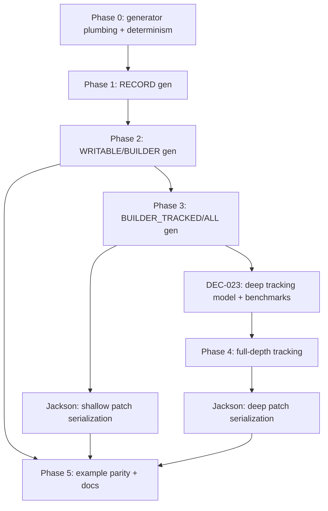

# Plan: `hipster-entity` — path to first usable implementation

> Scope: everything under `hipster-entity-api`, `hipster-entity-core`,
> `hipster-entity-jackson`, `hipster-entity-tooling`,
> `hipster-entity-test`, `hipster-entity-example`.
> Goal: define the concrete steps needed before a real project can
> depend on `hipster-entity` for entities/views with generated
> boilerplate, including full-depth change tracking.

## 1. Current state (verified 2026-09-19)

All six `hipster-entity-*` modules currently **compile and pass their
tests** (`mvn -pl hipster-entity-api,hipster-entity-core,hipster-entity-jackson,hipster-entity-tooling,hipster-entity-example,hipster-entity-test -am test`).
That is a better starting point than "prototype" — the primitives are
real and tested. What is missing is the *glue* that turns those
primitives into something a project can adopt end-to-end.

| Module | What exists | Maturity |
|---|---|---|
| `hipster-entity-api` | `EntityBase`, `Identifiable`, `FieldDef`, `FieldNameMapper`, `View`/`FieldSource`/`FieldKind` annotations, `GenLevel` enum, `ViewMeta`/`DefaultViewMeta`, `ViewReader`/`ViewWriter`/`ViewReadProxy`, `TypeUtils` | Stable contracts, no gaps for level 0-2 |
| `hipster-entity-core` | `EntityReadArray`, `EntityUpdateArray`, `EntityUpdateTrackingArray{,64,Large}`, `EEnumSet{,64,Large,Empty,All}`, `EEnumSetBuilder{,64,Large}`, `ArrayBackedViewProxyFactory`, `ViewChangeTracking` | Change-tracking primitives are implemented and unit-tested (bitset based, DEC-012/DEC-014) |
| `hipster-entity-jackson` | `EntityJacksonViewSerializer` (writes a `ViewReader` to Jackson `JsonGenerator`) | Serialization-only, one direction (write), no deserializer yet |
| `hipster-entity-tooling` | `EntityMetadataGenerator` (JavaParser-based: interfaces → `*.metadata.json` + generated `View_` field enum), `FieldBoilerplateGenerator`, `EntityRulesValidator` (marker/view naming/annotation lint rules) | **This is the only real "codegen" today** — it emits field enums, but does **not** yet emit records, builders, tracking builders, or wire them into `ViewMeta` |
| `hipster-entity-example` | Hand-written `person`/`paymentMethod` packages showing every `GenLevel` by hand (incl. `PersonSummaryBuilderTracking`) | These are **manually written reference implementations**, i.e. "what the generator should eventually produce", not generated output |
| `hipster-entity-test` | JUnit tests for core + api | Covers primitives, not the full pipeline |

Key structural fact: **there is no annotation processor and none is
wanted** (AGENTS.md §1 / DEC-019). `EntityMetadataGenerator` is a
sidecar tool (JavaParser source scan → JSON + generated source),
consistent with DEC-009. That tool must be extended, not replaced.

The materialization-level ladder (`GenLevel`: `META → RECORD →
WRITABLE → BUILDER → BUILDER_TRACKED → BUILDER_ALL`) is fully
specified in [doc-hipster-entity/architecture/materialization-levels.md](../doc-hipster-entity/architecture/materialization-levels.md)
and [doc-hipster-entity/user/materialization-guide.md](../doc-hipster-entity/user/materialization-guide.md),
and hand-written examples exist for every level. **The generator only
implements level `META`.** Everything above that is the gap between
"library of primitives" and "first usable implementation".

## 2. Definition of "first usable implementation"

A real project can:

1. Add `hipster-entity-api`/`-core` as Maven dependencies (and
   `-jackson` optionally).
2. Write one plain interface per entity/view (`@View`, extending
   `EntityBase<ID>`), following the documented naming rules.
3. Run a build step (`hipster-entity-tooling` CLI/Maven plugin) that
   regenerates, into the committed `src/main/java` tree:
   - the field enum (`View_`) — **already works**
   - the `Record` inner class for `RECORD`-level views
   - the `Write`/`Builder` classes for `WRITABLE`/`BUILDER`
   - the tracking builder for `BUILDER_TRACKED`/`BUILDER_ALL`,
     with full-depth (nested view) change tracking — see §4
4. Get compile errors (not runtime failures) if a view's interface
   changes shape and the generated code is stale.
5. Use `hipster-entity-jackson` to (de)serialize any generated view.
6. Re-run the generator safely on a project with hand-edits inside
   generated blocks (cooperative codegen, DEC-020) without losing
   those edits.

None of steps 3, 5 (deserialize direction), or 6 exist yet in
automated form; step 3 exists only for the field-enum sliver.

## 3. Phased plan

### Phase 0 — Close the loop that already almost works (housekeeping)
*Goal: make the existing generator trustworthy before building on it.*

- [ ] Add a `hipster-entity-tooling` Maven plugin (or `exec-maven-plugin`
  binding) so `EntityMetadataGenerator` runs as part of `mvn generate-sources`
  in a consuming project, not only via `main(String[])` / tests.
- [ ] Make `EntityRulesValidator` fail the build (configurable
  severity) instead of only being exercised from unit tests.
- [ ] Add a regression test that runs the generator twice in a row on
  the same source tree and asserts byte-identical output (determinism
  is a prerequisite for cooperative codegen in Phase 2).
- [ ] Document the CLI/plugin usage in `hipster-entity-tooling/README.md`
  (currently only a functional spec in `doc/GENERATOR-FUNCTIONAL-SPEC.md`).

### Phase 1 — Generate the `RECORD` level
*Goal: `@View(gen = GenLevel.RECORD)` (or default when no write is
needed) produces the same shape as the hand-written examples in
`hipster-entity-example/.../person/entity/PersonSummary.java`.*

- [ ] Extend `EntityMetadataGenerator`'s per-view output: emit the
  interface's `record Record(...) implements View {}` inner class
  (or top-level `View.Record`, matching the convention already used
  in the example module) using JavaParser to splice it into the
  existing interface file — this is the first real test of the
  DEC-020 cooperative-block rule (recognize-by-shape: a
  `record Record(...)` inside the interface body).
- [ ] Emit the companion `ViewMeta` constant (`public static final
  ViewMeta<View, View_> META = ...`) per `GENERATOR-FUNCTIONAL-SPEC.md`
  §FieldBoilerplateGenerator (`withMetaCreatorBody`) — currently
  specified but not invoked from `EntityMetadataGenerator`.
- [ ] Add generator class-file header (`// {@link ...}` + JSON5 config
  line) per DEC-021 to every generated/spliced file.
- [ ] New tests in `hipster-entity-tooling`: golden-file comparison
  against a fixture entity, asserting the spliced interface still
  parses and the record implements it.

### Phase 2 — Generate `WRITABLE` / `BUILDER`
*Goal: match `hipster-entity-example` builder classes (e.g. a
`PersonSummaryBuilder` sibling of `PersonSummaryBuilderTracking`).*

- [ ] Add builder-shape emission to `FieldBoilerplateGenerator`/
  `EntityMetadataGenerator`: field storage, `get(int)`, `set(int,Object)`,
  `set(String,Object)`, per-field fluent setters, `build()`.
- [ ] Reuse `ArrayBackedViewProxyFactory`'s `createUpdatable` path as
  the fallback for views that stay at `WRITABLE` (proxy-backed) instead
  of `BUILDER` (concrete class) — the generator must pick the emission
  strategy from `GenLevel`, not hardcode one.
- [ ] Cooperative-codegen block detection for builder methods
  (`withXxx`/setter shape) so hand-added convenience methods on a
  builder survive regeneration (DEC-020).
- [ ] Divergence reporting (DEC-022): when a field is renamed in the
  interface, the generator must report the stale builder method instead
  of silently leaving it.

### Phase 3 — Generate `BUILDER_TRACKED` / `BUILDER_ALL` (tracking)
*Goal: automate what `PersonSummaryBuilderTracking` demonstrates by
hand today, and extend it to full-depth tracking (§4).*

- [ ] Emit a class implementing `ViewChangeTracking<F, EEnumSetBuilder64<F>|EEnumSetBuilderLarge<F>>`
  choosing the 64-vs-Large variant from field count (mirrors
  `EntityUpdateTrackingArray.create`'s runtime choice, but decided
  **at generation time** since the field count is known statically —
  keep the runtime `.create()` path only for the array/proxy-backed
  route).
- [ ] Emit `mf.addOrdinalChange(ordinal, old, new)` calls in every
  setter, `isChanged()`/`changes()`, and the `get(int)`/`set(int,Object)`/
  `set(String,Object)` dispatch — same shape as the hand-written example,
  now generated.
- [ ] `BUILDER_ALL`: emit both the plain and tracking builder in one
  pass, sharing the field-storage shape (avoid duplicating the record
  reconstruction logic — extract a small shared internal helper method,
  not a public API).
- [ ] Wire `hipster-entity-jackson`'s serializer to accept a
  `ViewChangeTracking` source and optionally emit **only changed
  fields** (JSON PATCH / partial-update serialization) — this is the
  natural consumer of tracking and currently has no code path at all.

### Phase 4 — Full-depth change tracking (nested views)
*This is the specific gap called out in the request: today
`ViewChangeTracking`/`EEnumSetBuilder*` only tracks changes at the
**top level** of one view. A field whose value is itself another
tracked view (e.g. `Person.address()` returns an `Address` view that
is itself `BUILDER_TRACKED`) currently has only one bit: "the
`address` reference was reassigned". It cannot express "the `address`
reference is unchanged, but its `city` field changed".*

- [ ] **Decide the semantic model** (needs a DEC, see §5): does
  "changed" propagate up automatically from a nested tracked builder
  to its parent, or must the parent explicitly re-`mark()` the field
  when a nested builder mutates? Two candidate designs:
  - **A. Push model** — nested tracking builder holds a back-reference
    (parent tracking array + own ordinal) and calls `parent.mark(ordinal)`
    whenever any of its own fields change. Zero-cost when untouched,
    but couples the child's lifecycle to a specific parent instance
    (can't share/reuse a nested builder across parents).
  - **B. Pull model** — parent's `isChanged()`/`changes()` walk into
    every field whose static type implements `ViewChangeTracking` and
    OR the child's `isChanged()` into the parent's reported state,
    without mutating the parent's own bitset. Cheap to implement,
    keeps children reusable, but changes what "the parent's bit for
    that field" means (it becomes derived, not stored) — needs a
    distinct accessor, e.g. `changesDeep()` vs `changes()`, so shallow
    and deep views are both available and explicit.
  - Recommendation to validate first: **B** (pull/`changesDeep()`),
    because it composes without parent/child coupling and matches the
    project's "explicit, navigable" bias (DEC-019) — the deep walk is
    a concrete method body, not hidden propagation.
- [ ] Define the **path representation** for a deep change: a flat
  `EEnumSet<F>` cannot express "which field, how many levels down,
  under which collection index". Introduce a small navigable value
  type, e.g.:
  ```java
  public record ChangePath(FieldDef field, int listIndex /* -1 if n/a */, ChangePath next /* null if leaf */) {}
  ```
  and `ViewChangeTracking.changesDeep()` returns
  `List<ChangePath>` (or a lazy `Stream`) alongside the existing
  shallow `changes()`.
- [ ] Extend `EEnumSetBuilder{64,Large}` (or add a sibling type — do
  **not** overload the existing bitset classes with tree semantics)
  with a `NestedChangeIndex` that maps ordinal → child tracking builder
  reference, only allocated when a field's declared type is itself a
  `ViewChangeTracking`. Must stay allocation-free for entities that
  don't use nested views (no regression for the common case — this is
  the same "pay only for what you use" discipline as DEC-014's 64 vs
  Large split).
- [ ] Handle **collections of tracked views** (`List<Address>` where
  `Address` is `BUILDER_TRACKED`): tracking must record per-index
  changes plus structural changes (add/remove/reorder) distinctly from
  per-field mutation — this is the hardest sub-problem; scope it as
  its own DEC section with acceptance tests before implementing.
- [ ] Generator support: `EntityMetadataGenerator` must detect, for
  each field, whether its type is itself a `@View`-annotated tracked
  type (including generic collections thereof) and emit the deep-index
  wiring in the generated tracking builder — this is a `TypeDescriptor`
  question already partially modeled in `hipster-entity-tooling`'s
  `TypeDescriptor`/type-parsing code (extend, don't rewrite).
  Discriminated/polymorphic view roots (already supported in
  `FieldBoilerplateGenerator`'s discriminator/subtype params) must also
  be representable in the deep-change path.
- [ ] `hipster-entity-jackson`: emit deep-changes as a nested JSON PATCH
  (RFC 6902-like) document from `changesDeep()`, so a caller can persist
  only the touched leaf fields across arbitrarily nested entities.
  This is the concrete "full depth tracing of changes" deliverable
  requested — validate it against a fixture with 3+ nesting levels and
  a `List<Tracked>` field.
- [ ] Benchmarks (JMH, following the DEC-014 precedent) comparing
  push vs pull model overhead on both "no nested change" and "deep
  nested change" cases before locking the decision.

### Phase 5 — Example, docs, and adoption path
- [ ] Regenerate `hipster-entity-example` fully from the generator
  (instead of hand-written) to prove parity — any diff between
  generator output and the current hand-written files becomes either
  a generator bug or an intentional documented divergence.
- [ ] Add a `hipster-entity-example` scenario exercising Phase 4 (a
  nested tracked view, plus a `List<Tracked>` field) as the canonical
  "full depth tracing" demo and integration test.
- [ ] Write a "getting started in a new project" guide: add
  dependency → write interface → run generator → use builder/tracking
  → serialize. This becomes the actual on-ramp for a real project;
  today's `doc-hipster-entity/user/materialization-guide.md` explains
  the levels but not the workflow to get there.
- [ ] Update `doc-hipster-entity/roadmap/README.md`'s checklist and
  `DEC-012` (extend or add `DEC-023` for the deep-tracking model
  decided in Phase 4) so the decision is traceable per AGENTS.md rules.

## 4. Full-depth change tracking — summary of the concrete deliverable

Because this was called out explicitly: the work is **not** "wire up
`ViewChangeTracking`" (that already exists at one level, tested, and
used in `EntityUpdateTrackingArray`/`EEnumSetBuilder*`). The real gap
is:

1. No representation today for "a change occurred N levels deep inside
   a nested view or collection of views" — only "this ordinal at this
   level changed".
2. No generator support for detecting nested trackable fields and
   wiring the deep index.
3. No serialization consumer that turns a deep change set into a
   partial-update payload (JSON PATCH-like) — this is the actual
   end-user-visible payoff of tracking.

Phase 4 above sequences: (a) pick push-vs-pull semantics with a DEC and
a benchmark, (b) define the `ChangePath`/`changesDeep()` contract in
`hipster-entity-api`/`-core`, (c) implement the nested index in `-core`,
(d) implement collection-of-tracked handling, (e) teach the generator
to emit the wiring, (f) teach `hipster-entity-jackson` to serialize it,
(g) prove it end-to-end in `hipster-entity-example` with a 3+ level
fixture.

## 5. New/updated architecture decisions needed

- **DEC-023 (new)**: Full-depth change tracking model — push vs pull,
  `ChangePath` shape, collection semantics. Must be written and
  accepted *before* Phase 4 implementation starts, per the project's
  existing DEC-per-decision convention (DEC-012/014 are the direct
  precedents).
- **DEC-012 amendment**: cross-reference DEC-023 once accepted (DEC-012
  currently only covers single-level tracking).
- No change needed to DEC-019/020/021/022 — Phases 1-4 are explicitly
  designed to comply with them (cooperative blocks, class-file headers,
  refactor-sensitivity, source-visible wiring); each phase above calls
  out the specific compliance point.

## 6. Suggested execution order (dependencies)



Phases 0-3 are the critical path to "a project can use `@View` +
generator for CRUD-style entities with change tracking at one level" —
that alone is already a usable first release. Phase 4 (full-depth) is
additive and can ship as a follow-up minor version once DEC-023 is
accepted, without breaking Phases 0-3 consumers (the shallow `changes()`
API keeps working; `changesDeep()` is new).
